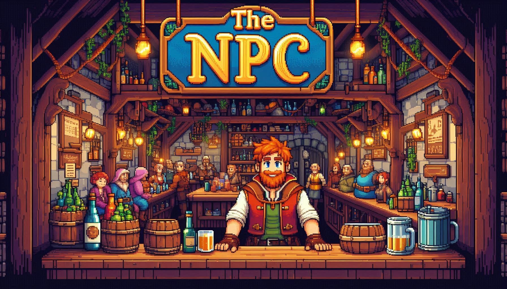
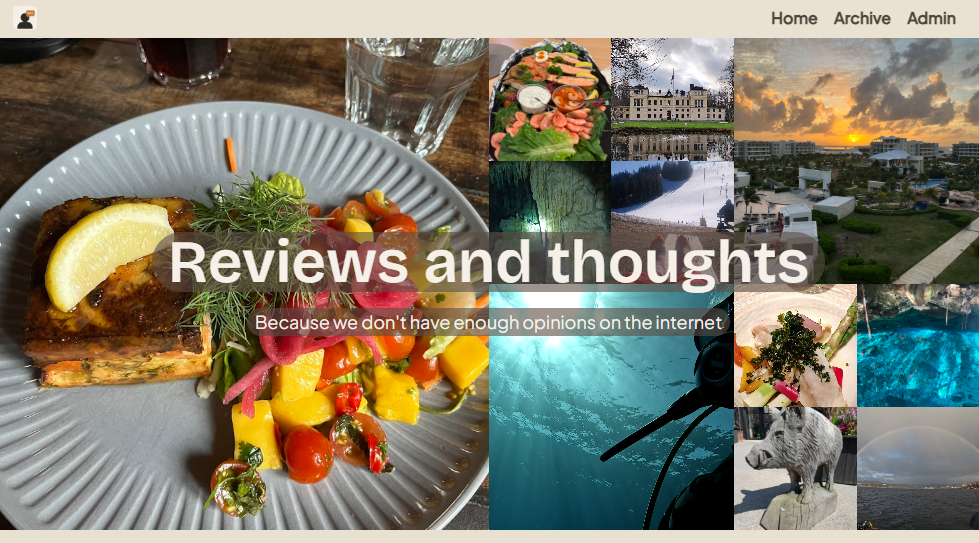
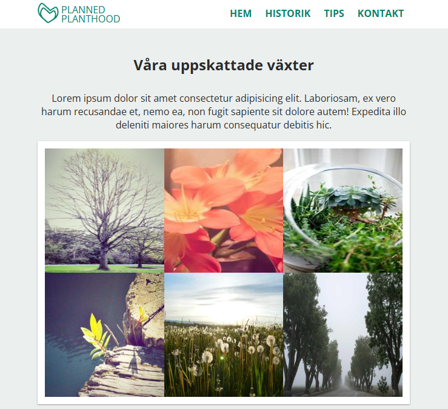

# 👋 Frontend Developer with Business & IT Background

 
 

Frontend-focused developer with a foundation in business economics and system development. I build user-centric solutions with a strong focus on structure, clarity, and business value.

<table>
<tr><td valign="top">
      
## 🚀 About Me
- Analytical, curious, and solution-oriented  
- Combines developer and business mindset  
- Bridge between business and IT  
- Focused on scalable, modern frontend applications  
- Translates complex needs into intuitive interfaces  
- Experience in financial analysis, structured, large-scale environments  and data-driven decisions
   
</td><td width=50% valign="top">
  
## 💼 What I Deliver
- Build responsive, modern frontend applications 
- Translate business requirements into intuitive front end solutions  
- Create structured, maintainable codebases  
- Develop data-driven interfaces using APIs and analytics tools  
- Improve workflows through automation, structure, and clear processes
   
</td>
</tr>
<tr>
<td width=50% valign="top">

## 🧠 Core Skills
- Frontend development (component-driven, responsive design)  
- State management and API integration  
- Data visualization and reporting  
- Database development and ETL flows  
- Financial analysis and cost awareness in tech decisions  
- Agile workflow and cross-functional collaboration
   
</td><td width=50% valign="top">
      
## 🛠️ Tech Stack
**Frontend:** HTML, CSS, TypeScript, React, Next.js, Tailwind  
**Backend/Tools:** Node.js, Prisma, REST APIs  
**Data:** Power BI, QlikView, SQL, PostgreSQL  
**Other:** Git, Microsoft 365, Agile (SAFe, Lean)
   
</td>
</tr>

<tr>
<td colspan="2">

## 📂 Featured Projects

<table>
  <tr>
    <th width=33%>The Npc</th>
    <th width=33%>Reviews and Thoughts</th>
    <th width=33%>Planned Planthood :sweden: </th>
  </tr>
  <tr>
    <td align="center"><a href="./">
     
    </a>
    </td>
    <td align="center"><a href="https://github.com/fnelin/portfolioFE">
     
    </a>
    </td>
    <td align="center"><a href="https://github.com/fnelin/Planned-Planthood">
     
    </a> 
    </td>
  </tr>
</table>

</td></tr>
</table>
